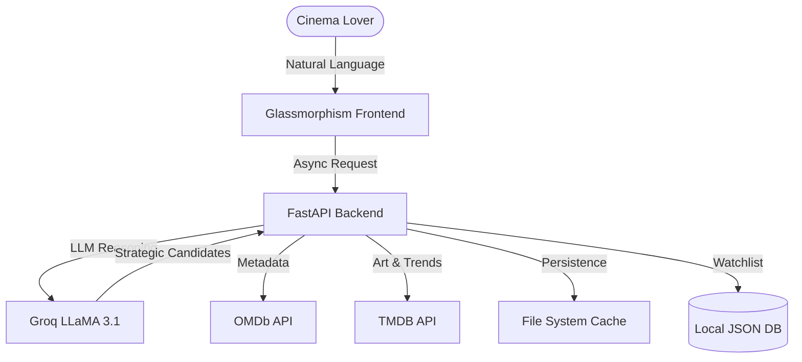

# 🎬 CineAI — One Stop for All Cinephiles


🚀 **Live Demo**: [cine-ai-gilt.vercel.app](https://cine-ai-gilt.vercel.app/)

[](https://cine-ai-gilt.vercel.app/)
[](LICENSE)
[](https://www.python.org/)
[](https://fastapi.tiangolo.com/)
[](https://groq.com/)

**CineAI** is a premium, AI-powered movie discovery engine designed for those who don't just watch films—they live them. From underground Tamil masterpieces to Hollywood cult classics, CineAI understands the subtle nuances of your cinematic cravings.

---

## 🏗️ High-Level Architecture

CineAI is built on a distributed agentic architecture that prioritizes relevance and aesthetic precision.



---

## ⚡ The Vibe & The Tech

CineAI merges a high-performance **FastAPI** backend with a sleek, glassmorphism-inspired **Vanilla JS** frontend.

### 🎭 Cinematic Features
- 🧠 **AI Recommendation Mode**: Describe your mood or a complex vibe. "Indie horror with 1980s synthwave aesthetics."
- 🔍 **Enriched Movie Lookup**: Beyond just a synopsis. Get 4-metric scores, streaming availability, and critical consensus.
- 🦸 **Character Archetype Mapping**: Find movies based on character tropes. Want another "stoic lone wolf"? We got you.
- 📅 **Decade Timelines**: Search specifically for eras. "90s grimy thrillers" or "Golden age Hollywood romance."
- ⚔️ **Metric Comparison Engine**: Side-by-side battle between two films using weighted analytics.

### 🔬 Advanced Metrics
Standard ratings are boring. CineAI uses a **Weighted Sentiment Index (WSI)**:
- **IMDb (35%)**: The global baseline.
- **Rotten Tomatoes (25%)**: Critical consensus.
- **Metacritic (20%)**: High-brow critical weighting.
- **Audience Score Proxy (20%)**: Derived via complex metadata parsing of vote density.

---

## 🚦 Quick Start for Cinephiles

### 1️⃣ Environment Setup
Clone the universe and install the logic:
```bash
git clone https://github.com/itslaks/Cine_AI.git
cd Cine_AI
pip install -r requirements.txt
```

### 2️⃣ Secret Sauce (Environment Variables)
Create a `.env` file in the root directory. You will need the following API keys to power the engine:

| Variable | Source | Description |
| :--- | :--- | :--- |
| `GROQ_API_KEY` | [console.groq.com](https://console.groq.com/) | Powers the AI reasoning & recommendations (Llama 3.1). |
| `TMDB_API_KEY` | [themoviedb.org](https://www.themoviedb.org/settings/api) | Fetches movie posters, trending lists, and OTT platforms. |
| `OMDB_API_KEY` | [omdbapi.com](https://www.omdbapi.com/apikey.aspx) | Provides full movie metadata and weighted IMDb ratings. |

```env
GROQ_API_KEY=your_groq_key_here
TMDB_API_KEY=your_tmdb_key_here
OMDB_API_KEY=your_omdb_key_here
```

### 3️⃣ Action!
Launch the engine:
```bash
python main.py
```
Explore the cinematic multiverse at `http://127.0.0.1:8000`.

---

## ☁️ Deployment

### Vercel (Recommended)
This project is configured for one-click deployment to Vercel.
- Uses `vercel.json` for Python runtime configuration.
- Automatically handles temporary storage via `/tmp` in serverless environments.
- **Note**: The watchlist is temporary in serverless sessions.

---

## 🛠️ Tech Stack
- **Backend**: Python 3.10+, FastAPI, Pydantic (Settings & Validations)
- **Frontend**: HTML5, Vanilla JavaScript, CSS3 (Glassmorphism UI)
- **LLM**: Groq (Llama-3.1-8b-instant), Ollama (Local Fallback)
- **Data**: OMDb API (Metadata), TMDb API (Posters & Streaming)

---

## 🤝 Contribution & Community
We're building the future of film discovery. Feel free to fork `itslaks/Cine_AI` and submit PRs for new discovery modes or aesthetic upgrades.

- **Architect**: [itslaks](https://github.com/itslaks)
- **Engine**: ⚡ LLaMA 3.1 
- **Soul**: 🍿 Cinema Enthusiasts
- **Live**: [cine-ai-gilt.vercel.app](https://cine-ai-gilt.vercel.app/)

---

## 📜 License
CineAI is released under the [MIT License](LICENSE).

---

*Stay cinematic.* 🎥✨
