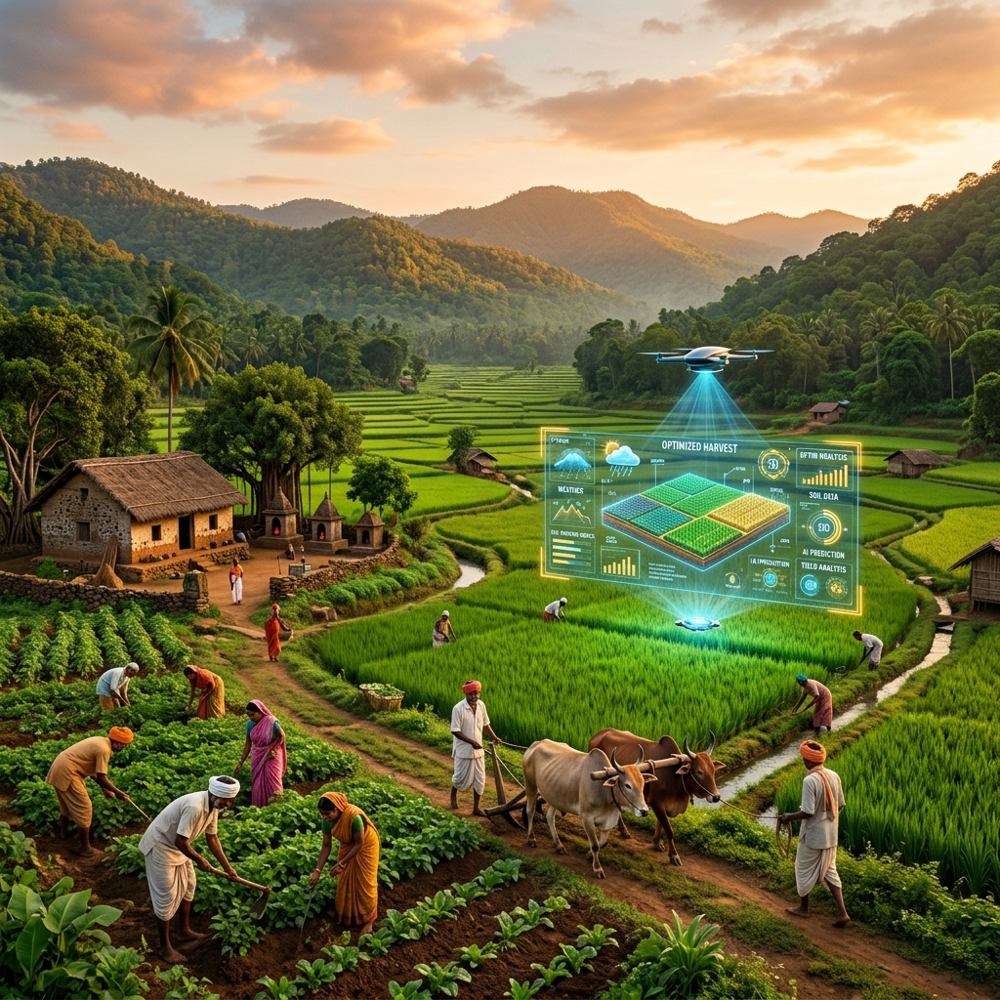
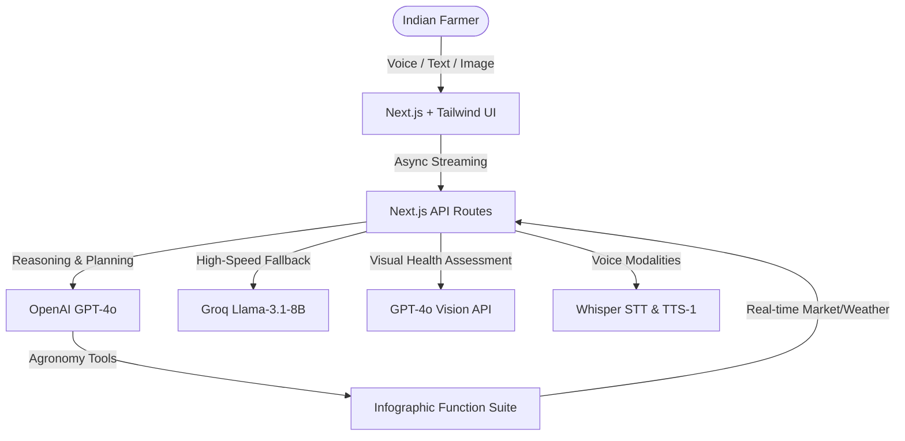

<div align="center">

# 🌾 VedaKrishi AI — Bharat's Smartest Farming Companion



🚀 **Live Demo**: [veda-krishi-ai.vercel.app](https://veda-krishi-ai.vercel.app/)

[](https://veda-krishi-ai.vercel.app/)
[](LICENSE)
[](https://nextjs.org)
[](https://openai.com)
[](https://groq.com)
[](https://sdk.vercel.ai)

**VedaKrishi AI** is a premium, voice-first, AI-powered agricultural ecosystem designed to empower the 140 million hands that feed Bharat. By merging ancient Vedic agricultural wisdom with cutting-edge AI, VedaKrishi understands the nuanced needs of every farmer in their native tongue.

---

> *"Every farmer deserves expert guidance — not just the ones who can afford it."*

</div>

---

## 🏗️ High-Level Architecture

VedaKrishi AI is built on a highly distributed, ultra-fast agentic architecture that prioritizes accessibility and localized relevance.



---

## ⚡ The Vibe & The Tech

VedaKrishi AI fuses an ultra-responsive Next.js App Router backbone with a stunning, nature-inspired, fluid UI crafted using Tailwind CSS v4 and Framer Motion. 

### 🎭 AI Ecosystem Features
- 🧠 **Dynamic Location-Aware Intelligence**: Tell it you're from Tamil Nadu, and it responds with seamless English & Tamil bilingual advice, automatically.
- 🗣️ **Voice-First Design**: Speak your queries naturally in 12 regional languages. It transcribes, answers, and even speaks back using optimized localized TTS voices.
- 🔬 **Computer Vision Crop Doctor**: Upload a leaf picture. Get a high-detail AI diagnosis identifying the disease, severity, organic treatments, and chemical alternatives.
- 📉 **Visual Farming Dashboards**: Automatic generation of beautiful infographic cards mapping live weather, government schemes, NPK soil balances, and live market trends.
- 🚀 **Zero-Latency Fallback**: The Groq hardware-accelerated Llama-3.1-8b engine instantly takes over if the primary cluster is slow, burning minimal tokens while retaining expert reasoning.

---

## 🚦 Quick Start for Harvesters 

### 1️⃣ Environment Setup
Clone the seeds of the project and install:
```bash
git clone https://github.com/yourusername/VedaKrishi_AI.git
cd VedaKrishi_AI
npm install
```

### 2️⃣ Secret Sauce (Environment Variables)
Create a `.env.local` file in the root directory. You will need the following API keys to ignite the engine:

| Variable | Source | Description |
| :--- | :--- | :--- |
| `OPENAI_API_KEY` | [platform.openai.com](https://platform.openai.com) | Primary brain: GPT-4o chat, Vision, Whisper STT, and TTS audio. |
| `GROQ_API_KEY` | [console.groq.com](https://console.groq.com/) | Hyper-fast fallback engine running Llama-3.1-8b-instant. |

```env
OPENAI_API_KEY=sk-your-openai-key-here
GROQ_API_KEY=gsk_your-groq-key-here
```

### 3️⃣ Action!
Ignite the development cluster:
```bash
npm run dev
```
Start your digital harvest at `http://localhost:3000`.

---

## ☁️ Deployment

### Vercel (Recommended)
This project is pre-configured for instant serverless deployment out of the box to Vercel.
- The included `vercel.json` natively sets maximum API durations limits to 60s to completely rule out streaming timeouts.
- Next.js configurations (`next.config.mjs`) are optimized for cloud-based edge runtimes.
- Built-in React 19 concurrent boundaries keep the UX silky smooth even on spotty 3G village networks.

---

## 🛠️ Tech Stack
- **Backend Framework**: Next.js 16 (App Router), Vercel AI SDK v5
- **Frontend Engine**: React 19, Tailwind CSS v4, Lucide React Icons
- **LLM Cognitive Layer**: OpenAI GPT-4o (Primary), Groq LlaMA-3.1-8B (Fallback)
- **Computer Vision**: OpenAI GPT-4o-Vision
- **Modality Engine**: Whisper-1 (Speech-to-Text), OpenAI TTS-1 (Text-to-Speech)

---

## 🤝 Contribution & Community
We're building the future of Bharat's agriculture. Feel free to fork the repo, experiment with localized hyper-models, or add new integration hooks for eNAM or open weather networks.

- **Architects**: VedaKrishi Team
- **Engine**: ⚡ GPT-4o + LLaMA 3.1 
- **Soul**: 🌾 140 Million Farmers
- **Live Ecosystem**: [veda-krishi-ai.vercel.app](https://veda-krishi-ai.vercel.app/)

---

## 📜 License
VedaKrishi AI is released under the [MIT License](LICENSE).

---

*Grow with Knowledge. Harvest with Pride.* 🌱✨
